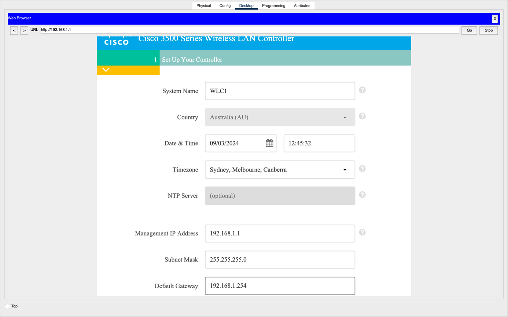
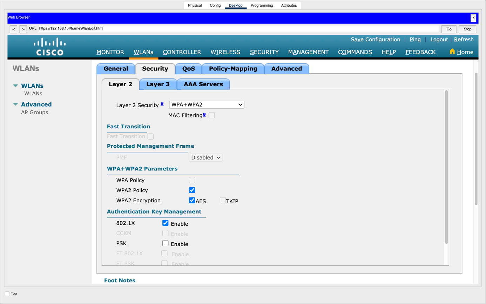
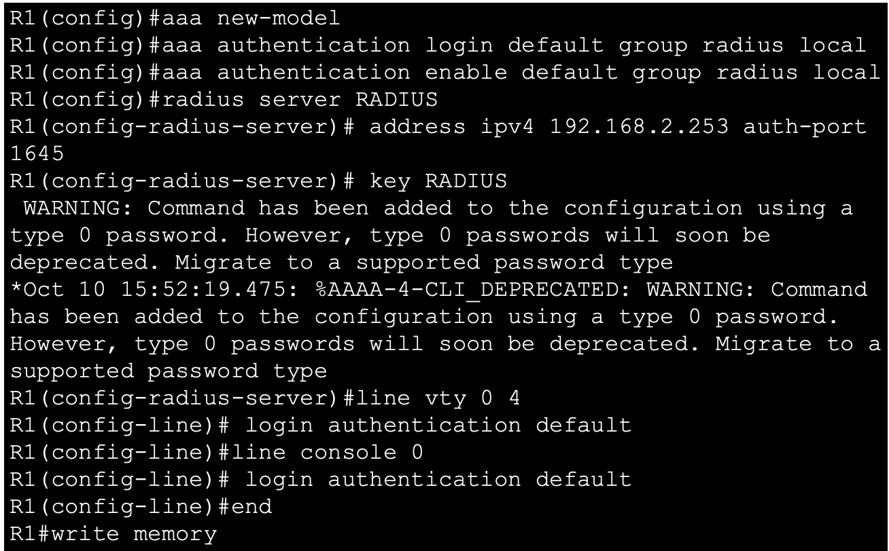
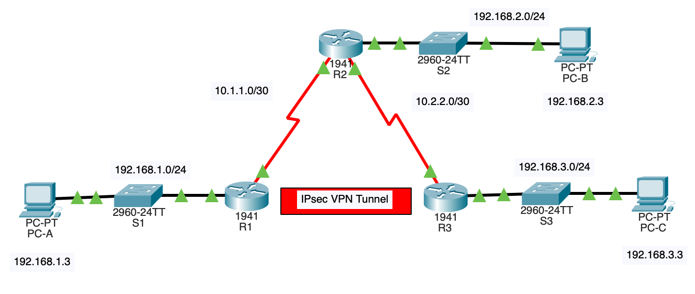
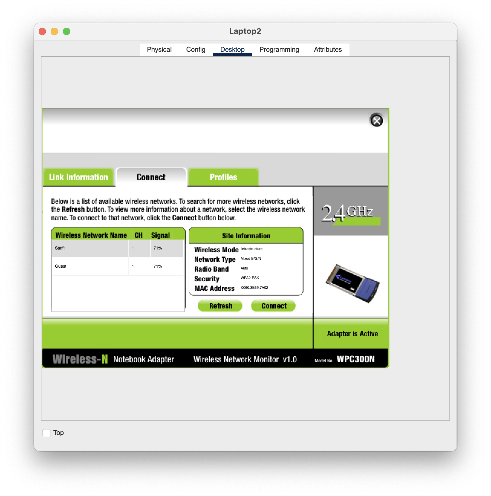
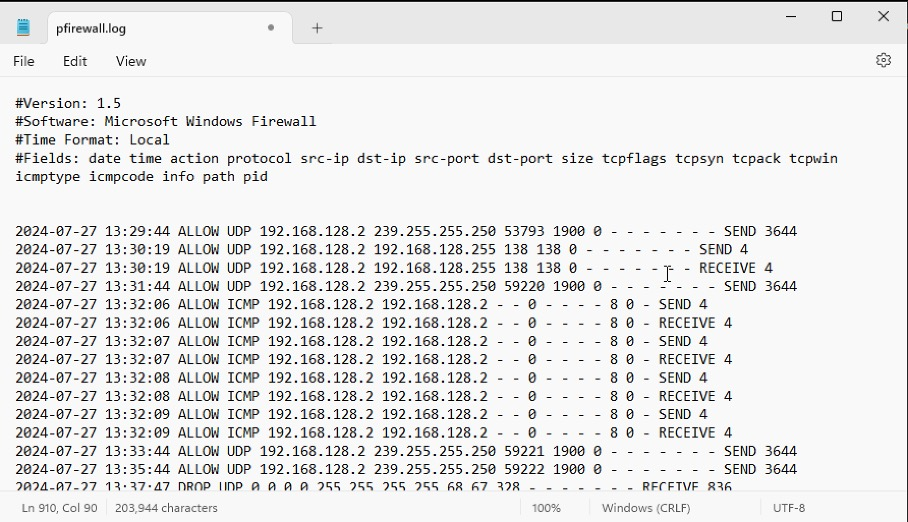
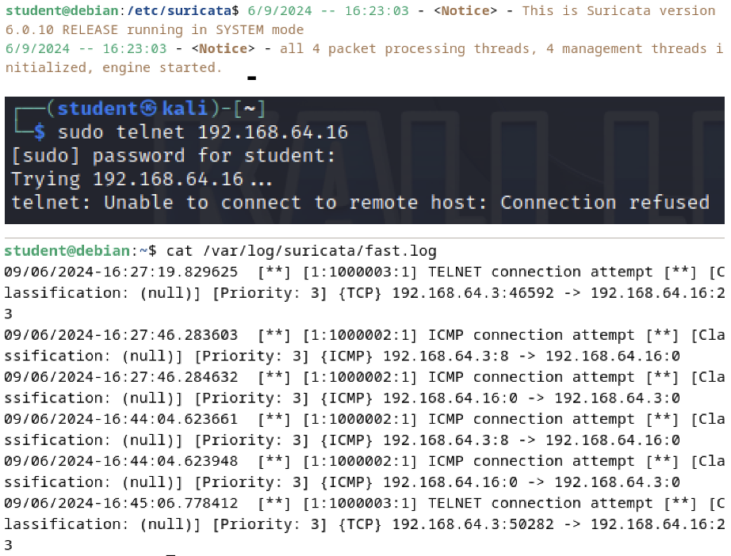
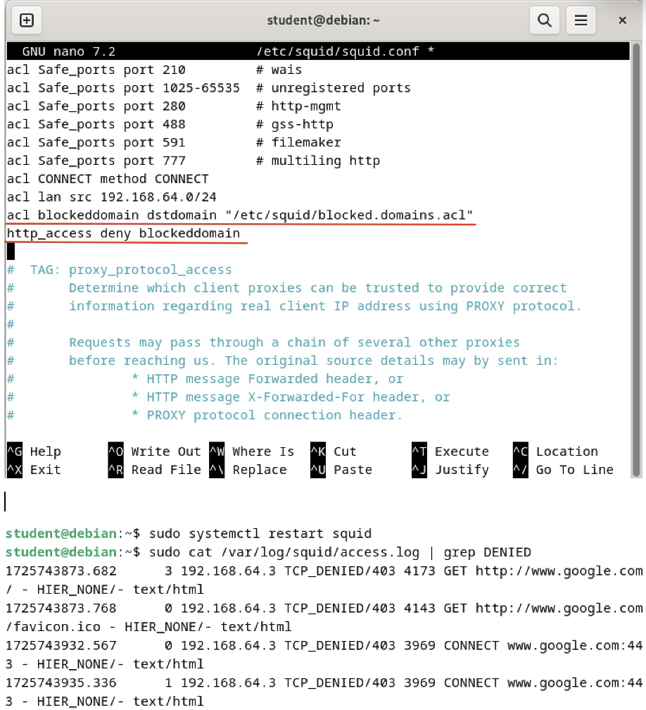

# Network Hardening and WLAN Security

### Tools Extended  
- Packet Tracer: Network simulation and topology validation  
- CLI: Manual interaction with operating systems and network devices  
- RADIUS Server: AAA authentication for enterprise WLAN  
- NetStumbler: Wireless network discovery and auditing  
- Suricata: IDS/IPS detection and alerting tool  
- Squid Proxy: HTTP proxy for access control and traffic filtering  
- Kali Linux: Attacker operating system for testing

## Network Infrastructure Hardening

**Security Overview**   
- Role-Based Access Control (RBAC) for HR/Finance departments  
- AAA authentication via RADIUS server  
- WPA2-Enterprise with 802.1X authentication  
- Guest network isolation  

**Implementation Summary**  

Cisco Router AAA Configuration:  
Router Basics:
<pre><code>hostname R1
line console 0
password cisco123
login
transport input ssh</code></pre>
RADIUS Auth:
<pre><code>aaa new-model
radius server RADIUS
address ipv4 192.168.2.253 auth-port 1645
key MySecureKey</code></pre>
Wireless Security:
<pre><code>dot11 ssid Staff
authentication open eap TLS
guest-mode
Guest Network:
vlan 100
name Guest
ip access-group Guest-Policy in</code></pre>

WPA2-Enterprise Setup:  

Guest Network Isolation:

**Tools Used**  

Cisco ISE for Zero Trust Policy:
Supporting Configuration:

<pre><code>cisco
R1(config)#radius server RADIUS  // Points to ISE server
R1(config-radius-server)#address ipv4 192.168.2.253 auth-port 1645/</code></pre>

Cisco Packet Tracer Topology:  

NetStumbler for WLAN Auditing:

---

## Zero Trust Implementation

**Security Overview**  
- Firewall rules to block unauthorized traffic
- Suricata IDS to log and detect threats
- Squid Proxy to restrict web access
- Log reviews to validate traffic control    

**Implementation Summary**  

Device Authentication Logs:  

Suricata IDS Alerts:  

Squid Proxy Implementation:

---

 ## Notes
- All configurations deployed in a lab environment mimicking enterprise networks  
- Security controls were stress-tested using Kali Linux penetration tools  
- Complies with NIST SP 800-53 security controls 
